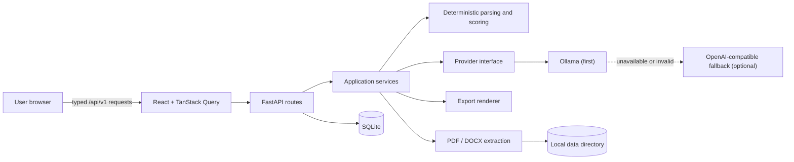
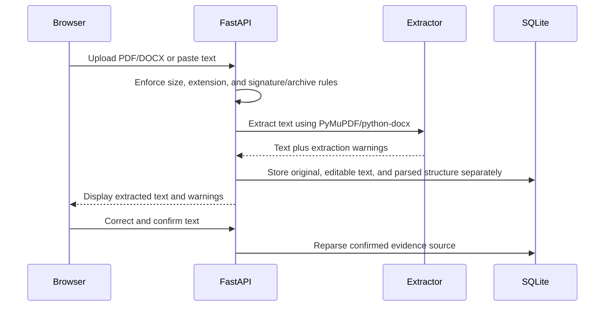

# Architecture

MatchCraft is a modular monolith: a React client, one FastAPI process, one SQLite database, local file storage, and an optional model-provider adapter. This is deliberate for a single-user local release; it keeps deletion, migrations, debugging, and privacy boundaries understandable.

## Frontend

`apps/web` is a strict TypeScript Vite application. React Router defines dashboard, ingestion review, results, bullet workshop, interview, history, and settings routes. Routes are lazy-loaded so charting code is limited to the results bundle. TanStack Query owns server state; React Hook Form and Zod validate initial résumé text. The client renders backend results but does not recalculate scores.

The interface renders text as React text nodes. It does not inject job, résumé, model, or Markdown content as HTML. Exports are downloaded from backend routes.

## Backend

`apps/api/app/api/v1` contains thin versioned route handlers. Business logic lives in:

- `services/documents.py`: signature/archive validation, safe storage, extraction, file staging.
- `services/deletion.py`: the single cascade-delete transaction shared by the analysis, résumé, and job routes, including staged-file rollback.
- `services/parsing.py`: résumé sections and job requirements.
- `analysis/text.py`: normalization, skill catalog, term and accomplishment rules.
- `analysis/scoring.py`: the complete deterministic score model.
- `analysis/fabrication.py`: the anti-fabrication sanitizers and validators every model response must pass. These are domain rules, so they sit beside the deterministic analysis rather than inside the transport adapter.
- `services/analysis.py`: persistence of scores, evidence, recommendations, and questions.
- `providers/`: the provider-neutral contract and the Ollama/OpenAI-compatible HTTP implementation, including prompts, retry corrections, and credential scoping.
- `services/model_analysis.py`: provider lifecycle, health probing, and validated model-result persistence.
- `services/exports.py`: secret-free JSON and Markdown projections.

The import graph is strictly layered and acyclic: `main` → `api` → `services` → `analysis`/`providers` → `core`/`schemas`. `ProviderError` lives in `core/errors.py` because both the transport adapters and the deterministic validators raise it.

Routes use typed Pydantic requests/responses and a consistent error envelope. Request IDs are bound into structured logs without logging document bodies.

## Database and storage

SQLAlchemy models persist each résumé's reviewed text and one structured JSON parse, plus job description, requirement, analysis, category score, match evidence, recommendation, interview question, provider run, and application setting records. UUID identifiers and targeted indexes support history and evidence queries. SQLite foreign keys are enabled; relationships use database and ORM cascades. Write-only duplicate résumé section/experience/bullet tables were removed in migration `0002` so the reviewed parse has one source of truth.

Uploaded files use generated UUID filenames under `<data-dir>/uploads`, never the user filename. The database stores the original display filename, original extracted text, edited/confirmed text, and structured parsing separately. Editing either source invalidates linked scores, evidence,
recommendations, questions, and model results so stale excerpts cannot be presented against new
text. Export payloads are generated on demand; `<data-dir>/exports` is reserved for persisted future exports and is included in deletion cleanup.

## Document pipeline

Image-only PDFs yield an explicit warning and blank extraction; confirmation is blocked until the user supplies readable text. There is no silent OCR claim.

## Analysis pipeline

1. Parse explicit job requirements and their source excerpts.
2. Normalize known skills and locate exact résumé lines.
3. Evaluate contextual evidence, responsibilities, bullets, metrics, sections, and terms.
4. Calculate all eight weighted categories in backend code.
5. Persist score explanations and evidence independently.
6. If requested, call the configured provider after checking availability.
7. Validate strict JSON shape, evidence excerpts, talking points, metrics, skills, sensitive claims, titles, credentials, dates, and named entities inside the HTTP adapter and again before persistence.
8. Mark AI as completed, disabled, unavailable, or invalid; deterministic results remain usable unless deterministic analysis failed.

Model output does not silently replace deterministic scores. This keeps offline and online score behavior comparable.

## Provider abstraction

The `ModelProvider` protocol isolates availability checks, analysis, bullet rewriting, usage metadata, and normalized errors. `LocalFirstProvider` tries Ollama before a configured remote provider and records the provider/model that actually succeeded. Ollama and OpenAI-compatible payload differences stay in `providers/http.py`; official OpenAI calls use the Responses API, `store: false`, and strict Structured Outputs. Pydantic and the evidence validators remain authoritative. Provider runs store status, duration, usage counts, and error codes, never full prompts or responses.

## Export pipeline

Exports use a deliberate projection of analysis fields. They exclude API keys, provider URLs, model prompts, internal filenames, storage paths, and unnecessary usage metadata. Markdown is plain text; JSON mirrors the safe structured report. The original résumé is never overwritten.
